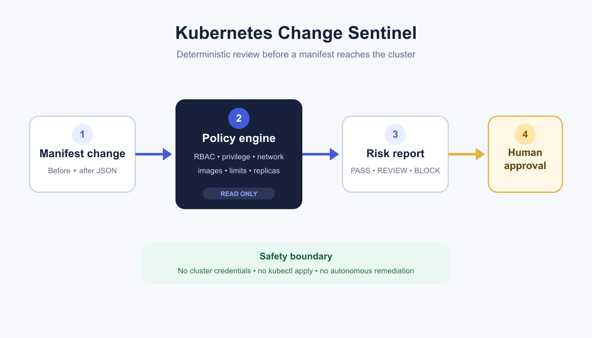

# Kubernetes Change Sentinel

Day 7 of Jeffrey Ikuoyemwen's Cloud + AI portfolio series.

Fast Kubernetes reviews often hide the changes that matter most: a privileged container, wildcard RBAC, host networking, an exposed load balancer, or a risky replica reduction. Kubernetes Change Sentinel converts a before-and-after manifest bundle into an explainable approval decision before anything reaches a cluster.



## What it demonstrates

- Deterministic policy-as-code for Kubernetes change risk.
- Explainable `PASS`, `REVIEW`, or `BLOCK` decisions with stable finding codes.
- Detection for privileged containers, `hostNetwork`, wildcard RBAC, cluster-wide bindings, unpinned images, missing resource limits, public load balancers, deletions, and replica reductions.
- A read-only safety boundary with no cluster connection or manifest application.
- CI-friendly exit codes and JSON output suitable for GitHub Actions, n8n, or an optional AI explanation layer.

## Architecture

1. Export the proposed manifests as a before-and-after JSON bundle.
2. Normalize resources by kind, namespace, and name.
3. Evaluate only changed, added, and deleted resources.
4. Produce a deterministic risk report.
5. Route `REVIEW` and `BLOCK` decisions to a human approver.

An LLM may summarize the findings later, but it cannot change the verdict or apply a manifest.

## Run locally

Python 3.11 or newer is recommended. The runtime has no third-party dependencies.

```bash
python -m pip install -e .
kubernetes-change-sentinel examples/change-request.json
```

The CLI exits `0` for `PASS`, `1` for `REVIEW`, and `2` for `BLOCK`.

## Run the tests

```bash
PYTHONPATH=src python -m unittest discover -s tests -v
```

## Run with Docker

```bash
docker build -t kubernetes-change-sentinel .
docker run --rm -v "$PWD/examples:/data:ro" kubernetes-change-sentinel /data/change-request.json
```

The example input is mounted read-only. The container has no Kubernetes credentials and makes no network calls.

## Input contract

The input contains arrays of Kubernetes objects:

```json
{
  "before": [{"kind": "Deployment", "metadata": {"name": "api"}}],
  "after": [{"kind": "Deployment", "metadata": {"name": "api"}}]
}
```

See [`examples/change-request.json`](examples/change-request.json) for a complete synthetic example.

## Safe deployment guidance

- Generate before/after bundles in CI from reviewed source, not from production credentials.
- Run the sentinel before any deployment or GitOps synchronization step.
- Protect the policy and workflow with pull-request review.
- Treat `BLOCK` as a hard stop and `REVIEW` as a required human decision.
- Keep remediation in a separate workflow with explicit approval.
- Do not place secrets, kubeconfigs, tokens, or sensitive live manifests in logs or sample files.

## Optional n8n workflow

[`n8n/change-review-workflow.json`](n8n/change-review-workflow.json) accepts a completed report and prepares an approval record. It intentionally contains no `kubectl`, credential, or cluster-write node.

## Repository structure

```text
src/kubernetes_change_sentinel/  Deterministic engine and CLI
tests/                           Unit tests
examples/                        Synthetic before/after bundle
docs/                            Architecture assets
n8n/                             Optional approval routing
.github/workflows/               Continuous integration
social/                          Medium, LinkedIn, and learning notes
```

## Limitations

This is a portfolio reference implementation. It reviews JSON resources and is not a replacement for admission control, live policy enforcement, or a full Kubernetes schema validator.

